# Tugas Rutin 11 — E-Commerce DB + Secure Auth

**Nama:** [nama kamu]
**NIM:** [NIM kamu]
**Mata kuliah:** [nama mata kuliah] — Pertemuan 11

Aplikasi e-commerce sederhana dengan Laravel + Breeze: database terstruktur
(7 tabel e-commerce), autentikasi, multi-role (admin/editor/user),
dan otorisasi dengan Policy.

## Teknologi
- Laravel [versi] · PHP 8.3 · Laravel Breeze (Blade) · MySQL · Tailwind CSS

## Cara Menjalankan
```bash
git clone [url repo]
cd TugasWeb-P11-EcommerceAuth
composer install
npm install
cp .env.example .env
php artisan key:generate
# atur DB_DATABASE di .env, lalu:
php artisan migrate:fresh --seed
npm run dev          # terminal 1
php artisan serve    # terminal 2
```
Buka http://localhost:8000

## Akun Testing (password: `password`)
| Role | Email |
|---|---|
| admin | admin@example.com |
| editor | editor@example.com |
| editor | editor2@example.com |
| user | user@example.com |

---

# Bagian A — Database & Eloquent

## 1. Migrations (7 tabel + FK)
| Tabel | Relasi / FK |
|---|---|
| categories | — |
| products | category_id → categories |
| addresses | user_id → users |
| orders | user_id → users, address_id → addresses |
| order_items | order_id → orders, product_id → products |
| reviews | user_id → users, product_id → products |
| cart_items | user_id → users, product_id → products |

Tambahan: kolom `role` pada `users`, tabel `posts` (untuk PostPolicy).

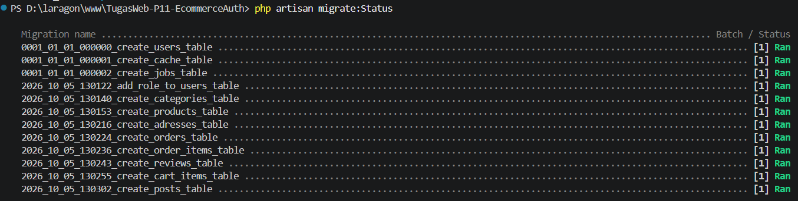

## 2. Seeder & Factory
- Factory: Category, Product, Post, Order
- Seeder: User, Product (54 produk realistis), Order, Post
- Dijalankan dengan `php artisan migrate:fresh --seed`

## 3. Model, Relationship, Scope
| Model | Relasi | Scope |
|---|---|---|
| User | hasMany orders, addresses, reviews, cartItems, posts | — |
| Category | hasMany products | — |
| Product | belongsTo category; hasMany orderItems, reviews | `active()`, `inStock()` |
| Order | belongsTo user, address; hasMany items | `paid()` |
| Post | belongsTo author | `published()` |

## 4. Dokumentasi Query Tinker

### Query 1 — Eager loading
```php
App\Models\Product::with('category')->take(5)->get(['id','name','price','category_id']);
```
Penjelasan: [isi penjelasan 1 kalimat]

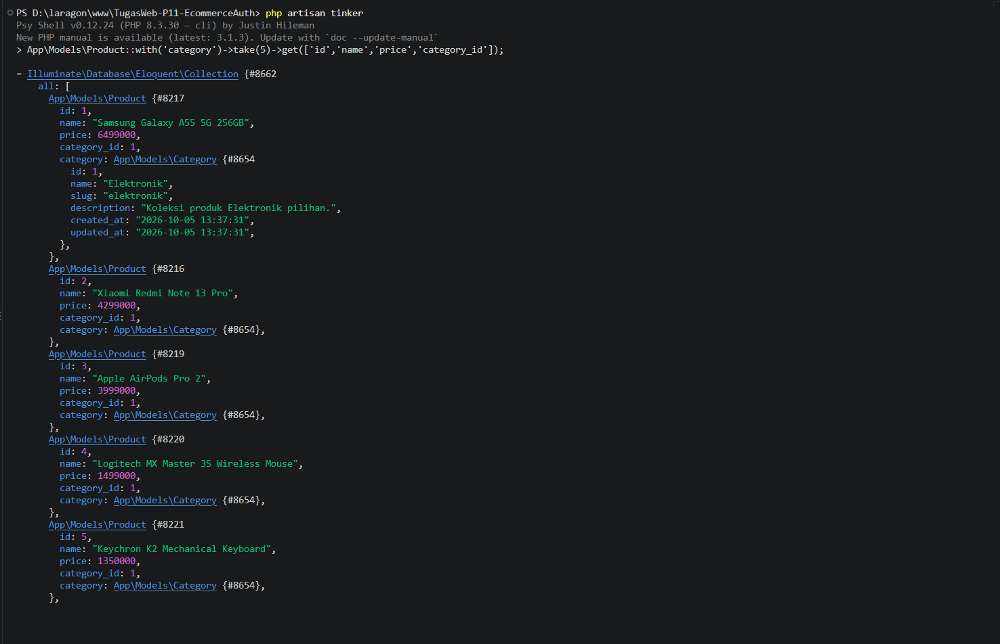

### Query 2 — Local scope
```php
App\Models\Product::active()->inStock()->orderBy('price')->take(5)->pluck('price','name');
```
Penjelasan: [isi]

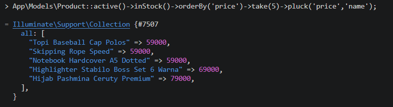

### Query 3 — withCount
```php
App\Models\Category::withCount('products')->get(['id','name']);
```
Penjelasan: [isi]

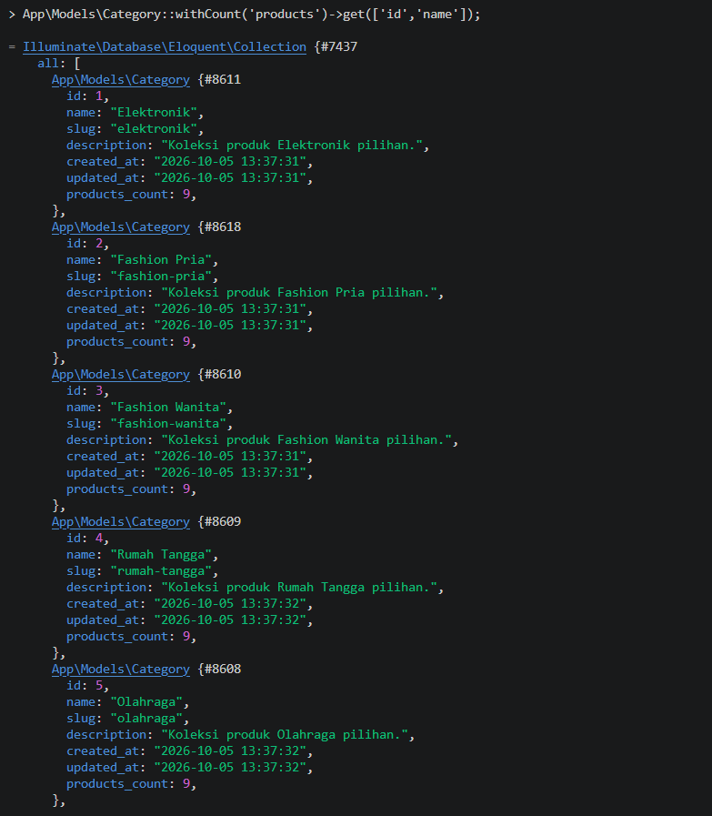

### Query 4 — Relasi bertingkat
```php
App\Models\User::where('email','user@example.com')->first()->orders()->with('items.product')->first()->items->pluck('product.name');
```
Penjelasan: [isi]

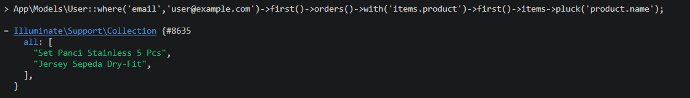

### Query 5 — Agregat
```php
App\Models\Order::paid()->sum('total');
```
Penjelasan: [isi]

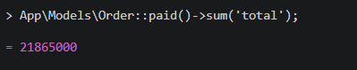

---

# Bagian B — Auth & Security

## 5. Breeze (login / register / logout)
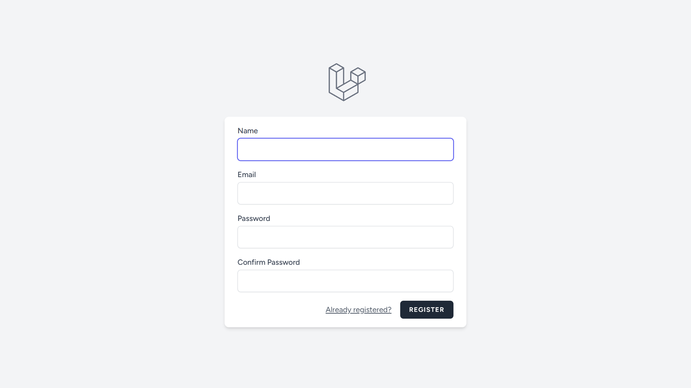
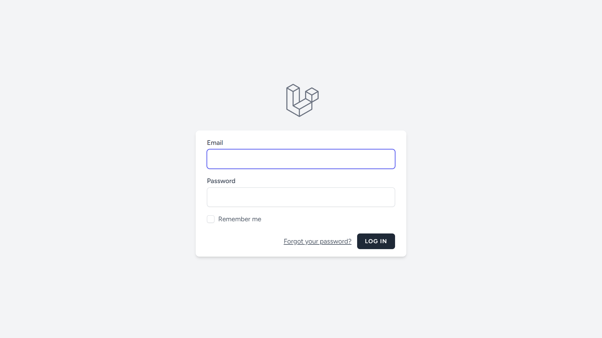

## 6. Multi-role + Custom Middleware
- Kolom `users.role`: `admin` | `editor` | `user`
- Middleware: `app/Http/Middleware/RoleMiddleware.php`
- Alias `role` didaftarkan di `bootstrap/app.php`
- Pemakaian di route: `role:admin`, `role:admin,editor`

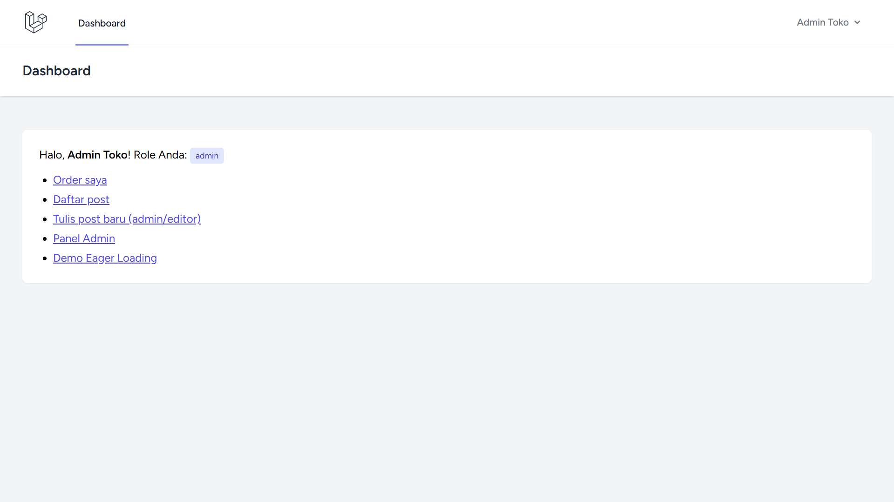
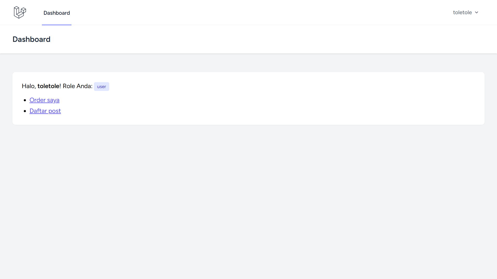

## 7. PostPolicy
| Aksi | admin | editor | user |
|---|---|---|---|
| Lihat daftar | ✅ | ✅ | ✅ |
| Buat post | ✅ | ✅ | ❌ |
| Edit/hapus post sendiri | ✅ | ✅ | ❌ |
| Edit/hapus post orang lain | ✅ | ❌ | ❌ |

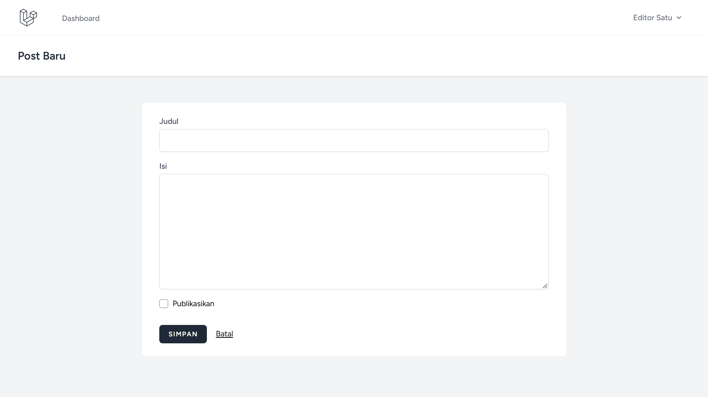
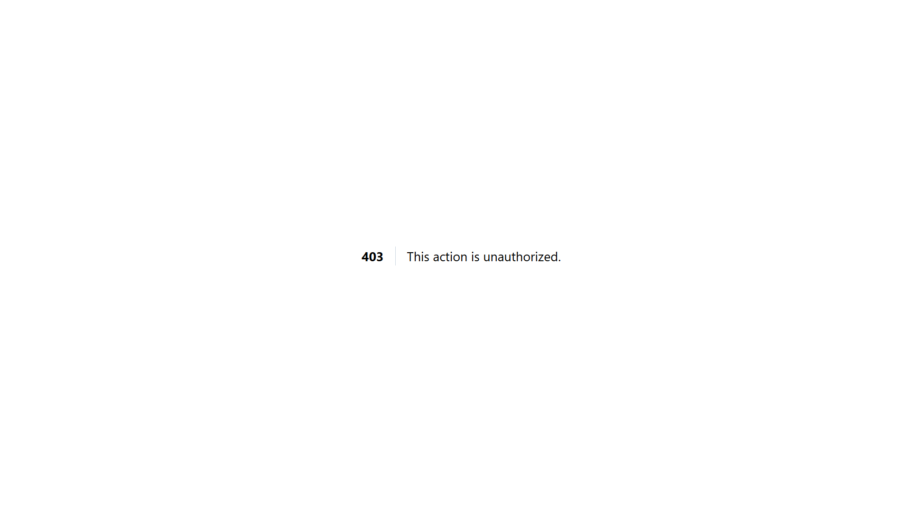
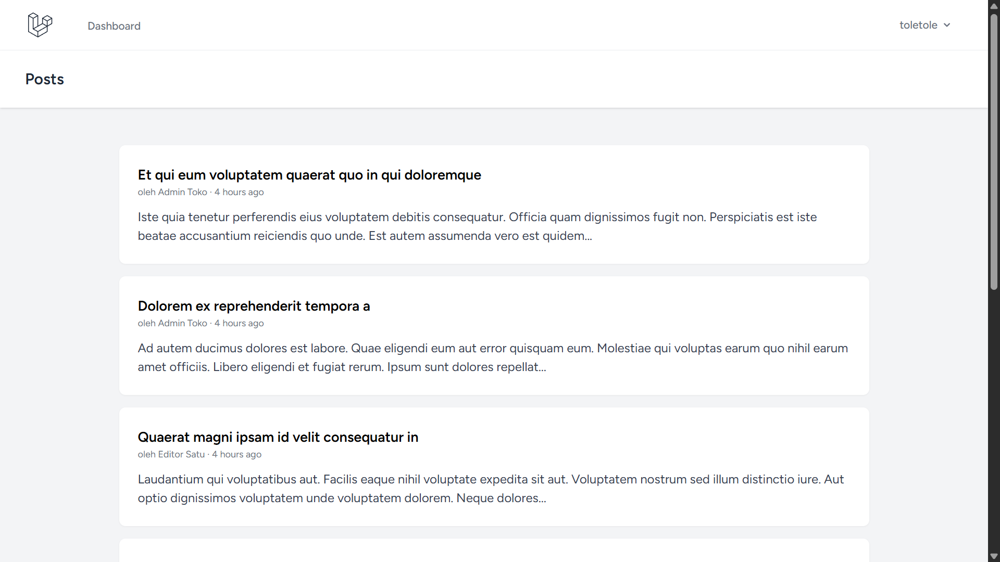

## 8. Route Protection & Testing Incognito (2 role)
Window biasa: [role A] · Window incognito: [role B]

| Skenario | Hasil yang diharapkan | Bukti |
|---|---|---|
| Admin buka `/admin` | 200 |  |
| User buka `/admin` | 403 |  |
| Tanpa login buka `/dashboard` | redirect ke login | [screenshot] |

Daftar route:
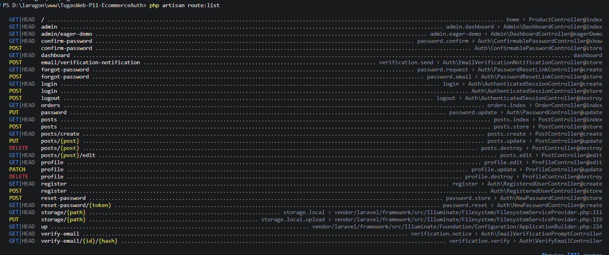

---

# Bonus
- **Eager loading demo** — `/admin/eager-demo`: tanpa eager loading [N] query,
  dengan `with('category')` [M] query.
  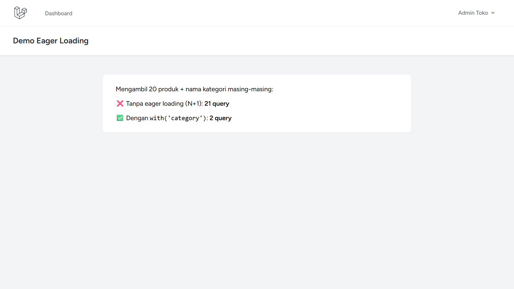
- **Filament admin panel** — [isi kalau dikerjakan, + screenshot]